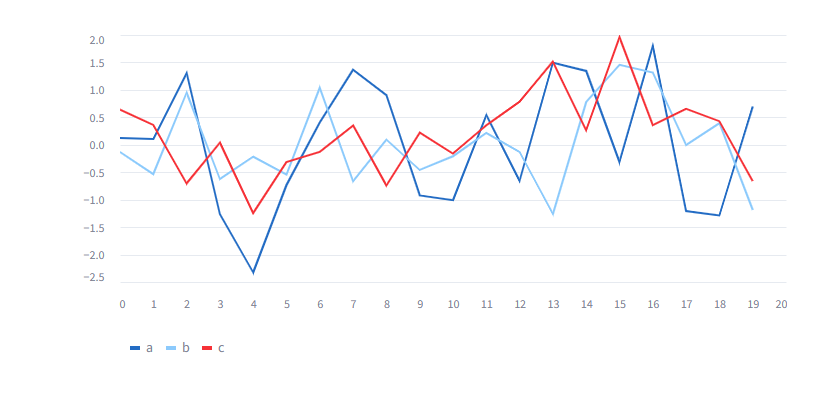

# infKEL
## Allgemein (Leander)

Projekt für den Informatikunterricht an der **Brecht-Schule Hamburg**. Ein Programm zum sammeln von Daten und der Verarbeitung. Dies passiert in einer Web-APP mit einem Nutzerfreundlichen UI.

## Welche Daten werden gesammelt? (Leander)

Ein Lehrer unserer Schule trägt nach dem Unterricht in der UI ein, wie aufgeräumt die Klasse ist. (Stühle hochgestellt, gefegt, Licht aus, etc.). Diese Daten werden über einen längeren Zeitraum gesammelt und dann visuell wiedergegeben. 

Ein mit Streamlit erstellter Graph, Beispiel für die visuelle Darstellung von den gesammelten Daten

merken: https://teachablemachine.withgoogle.com/
Streamlit ausführen:  python -m streamlit run <dateiname>.py
